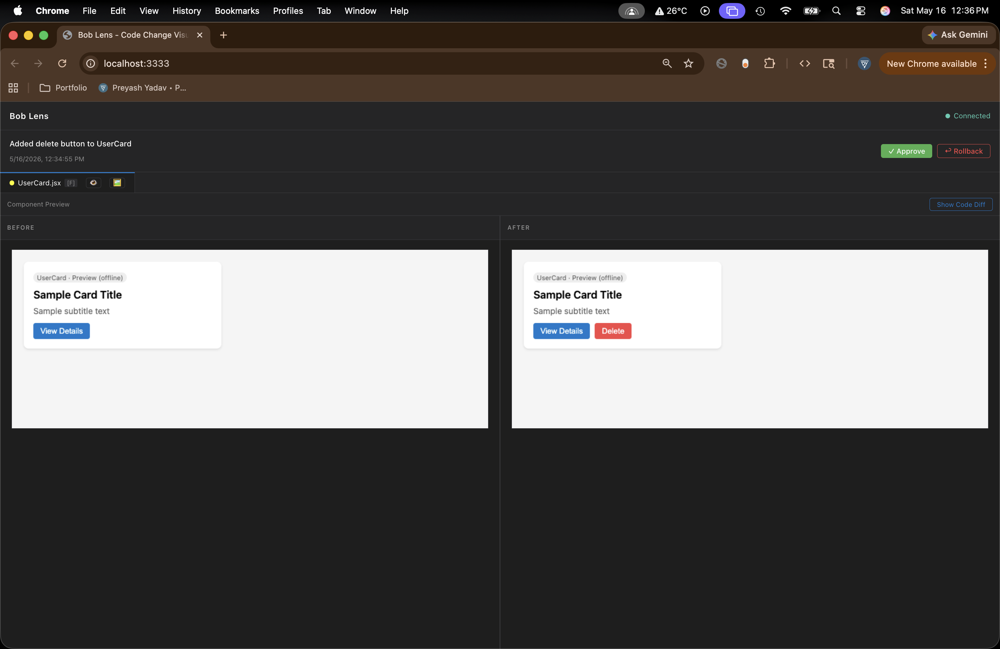
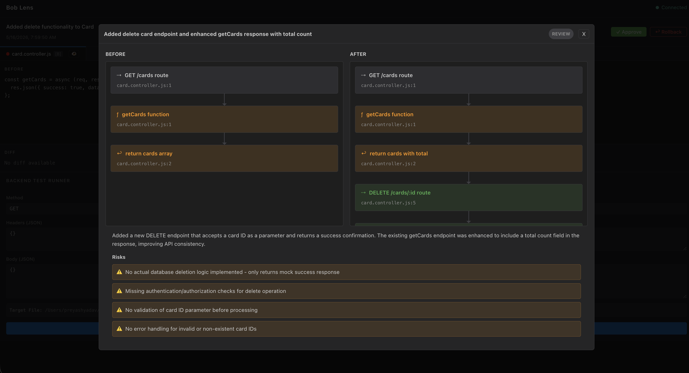

# Bob Lens 🔍

> See what IBM Bob changed. Understand it. Approve it with confidence.

[badges: IBM Bob Hackathon 2026 | Node >=18 | MIT License | Built by Preyash Yadav]



---

## What is Bob Lens?

Bob Lens is a developer tool that sits alongside IBM Bob IDE and visualizes AI-generated code changes in real time — before you approve them.

When IBM Bob modifies your code, Bob Lens automatically shows:
- **Side-by-side before/after diff** with character-level highlighting
- **Visual flow diagram** powered by BobShell — Bob explaining its own changes
- **Execution flow analysis** — what changed, what's at risk, verdict (Safe/Review/Risky)



---

## Why Bob Lens?

- AI agents ship code faster than humans can reason about it.
- Diffs show *what* changed, not *how behavior changes* in execution.
- Engineers end up approving changes they don’t fully understand — and paying for it later.

---

## How It Works

1. Bob edits files in your workspace.
2. Bob Lens receives an MCP change notification and snapshots before/after.
3. The UI renders diffs and groups changes into a review session.
4. BobShell analyzes the change and produces flow + risk verdict (Safe/Review/Risky).
5. You decide: approve with confidence or rollback immediately.

---

## Why IBM Bob Is Central

- **MCP integration**: Bob can trigger Bob Lens automatically when files change.
- **Checkpoint system**: Bob provides reliable before/after states to diff against.
- **BobShell analysis**: the agent that made the change can explain it programmatically.
- **Automatic triggering**: no PR, no manual wiring — the feedback loop stays live.

---

## Installation

### Option 1 — Global install (recommended)
```bash
npm install -g https://github.com/preyashyadav/bob-lens
```

### Option 2 — From source
```bash
git clone https://github.com/preyashyadav/bob-lens
cd bob-lens
npm run install:all
npm link
```

---

## Quick Start

```bash
# In any project
cd your-project
bob-lens init    # sets up .bob/mcp.json and AGENTS.md
bob-lens start   # starts UI + sandbox
```

Then:
1. Open `http://localhost:3333`
2. Open your project in IBM Bob IDE
3. MCP Settings → restart bob-lens → enable auto-approve
4. Ask Bob to make changes — Bob Lens visualizes them automatically

---

## Architecture

```
bob-lens start
├── UI (React)          → http://localhost:3333
├── Sandbox (Node.js)   → port 3334
└── WebSocket Bridge    → port 8080

IBM Bob IDE (via .bob/mcp.json)
└── MCP Server          → port 8082/8083
   ├── notify_change   → triggers UI update
   ├── ask_bob         → BobShell analysis
   └── run_test        → sandbox execution
```

---

## Tech Stack

| Layer | Technology |
|-------|-----------|
| UI | React + Vite |
| MCP Server | Node.js + @modelcontextprotocol/sdk |
| Analysis | IBM BobShell (CLI) |
| Diff | diff npm package |
| Sandbox | Node.js + isolated-vm |
| Screenshots | Puppeteer |

---

## Requirements

- Node.js 18+
- IBM Bob IDE (installed and logged in)
- IBM BobShell (`bob --version` should work)
- Git

---

## Built For

IBM Bob Hackathon 2026 — Theme: **"Turn idea into impact faster"**

Built by [Preyash Yadav](https://www.preyashyadav.com)
   - Watch execution animate through each layer:
     - Input validation
     - Middleware
     - Controller
     - Database operations
     - Response

8. **Make Your Decision**
   - Click **✓ Approve** to accept changes
   - Click **↩ Rollback** to revert changes

---

## Tech Stack

| Component | Technology | Purpose |
|-----------|-----------|---------|
| **MCP Server** | Node.js + @modelcontextprotocol/sdk | Connects Bob IDE to Bob Lens |
| **UI** | React + Vite | Displays changes and analysis |
| **Analysis** | BobShell (IBM Bob CLI) | AI-powered behavioral analysis |
| **Diff** | diff npm package | Generates unified diffs |
| **Sandbox** | Node.js + isolated-vm | Safe code execution environment |
| **Screenshots** | Puppeteer | Visual regression testing |
| **Styling** | Pure CSS with VS Code design tokens | Native IDE look and feel |

---

## Hackathon Submission Notes

**Built for IBM Bob Hackathon May 2026**

**Theme**: Turn idea into impact faster

### What Makes This Special

1. **Bob-Native Integration**: Uses MCP, checkpoints, and BobShell — features unique to IBM Bob
2. **Behavioral Focus**: Shows *what changed* in behavior, not just code
3. **Live Testing**: Execute changed code without deploying
4. **AI Self-Analysis**: Bob explains its own changes using BobShell
5. **Production-Ready**: Works with any existing codebase, no setup required

### Session Reports

All Bob development sessions are documented in `bob_sessions/` folder, showing the iterative development process with IBM Bob.

---

## Project Structure

```
bob-lens/
├── mcp-server/          # MCP server for Bob IDE integration
│   ├── src/
│   │   ├── index.ts     # Entry point
│   │   ├── server.ts    # MCP tool handlers
│   │   ├── services/
│   │   │   ├── change-tracker.ts    # Tracks file changes
│   │   │   ├── bobshell-runner.ts   # Runs Bob analysis
│   │   │   └── websocket.ts         # UI communication
│   │   └── tools/
│   │       ├── notify-change.ts     # MCP tool: notify_change
│   │       ├── ask-bob.ts           # MCP tool: ask_bob
│   │       └── run-test.ts          # MCP tool: run_test
├── ui/                  # React visualization UI
│   ├── src/
│   │   ├── App.tsx
│   │   ├── components/
│   │   │   ├── ChangeViewer.tsx     # Before/after code view
│   │   │   ├── AnalysisPanel.tsx    # Bob's analysis display
│   │   │   ├── FlowDiagram.tsx      # Visual flow graph
│   │   │   └── TestRunner.tsx       # Live test execution
│   │   └── hooks/
│   │       └── useWebSocket.ts      # Real-time updates
├── sandbox/             # Isolated code execution
│   ├── src/
│   │   ├── services/
│   │   │   ├── request-runner.ts    # HTTP request simulator
│   │   │   ├── vm-runner.ts         # VM isolation
│   │   │   └── screenshot.ts        # Visual testing
├── types/               # Shared TypeScript types
└── docs/
    └── screenshots/     # UI screenshots
```

---

## Development

### Running Individual Components

```bash
# MCP Server only
npm run dev:mcp

# UI only
npm run dev:ui

# Sandbox only
npm run dev:sandbox

# All together (recommended)
npm run dev
```

### Building for Production

```bash
npm run build:all
```

### Environment Variables

**mcp-server/.env**:
```env
BOB_PATH=/path/to/bob
WORKSPACE_PATH=/path/to/your/project
```

**ui/.env**:
```env
VITE_WS_URL=ws://localhost:8081
VITE_SANDBOX_URL=http://localhost:3334
```

**sandbox/.env**:
```env
PORT=3334
```

---

## Contributing

This project was built for the IBM Bob Hackathon 2026. Contributions are welcome!

1. Fork the repository
2. Create a feature branch
3. Make your changes
4. Submit a pull request

---

## License

MIT License - see LICENSE file for details

---

## Acknowledgments

- **IBM Bob Team** for creating an AI coding assistant with MCP support and BobShell
- **Model Context Protocol** for enabling seamless IDE integration
- **React Flow** for the visual flow diagram library

---

**Made with Bob** 🤖

*Turn idea into impact faster.*
