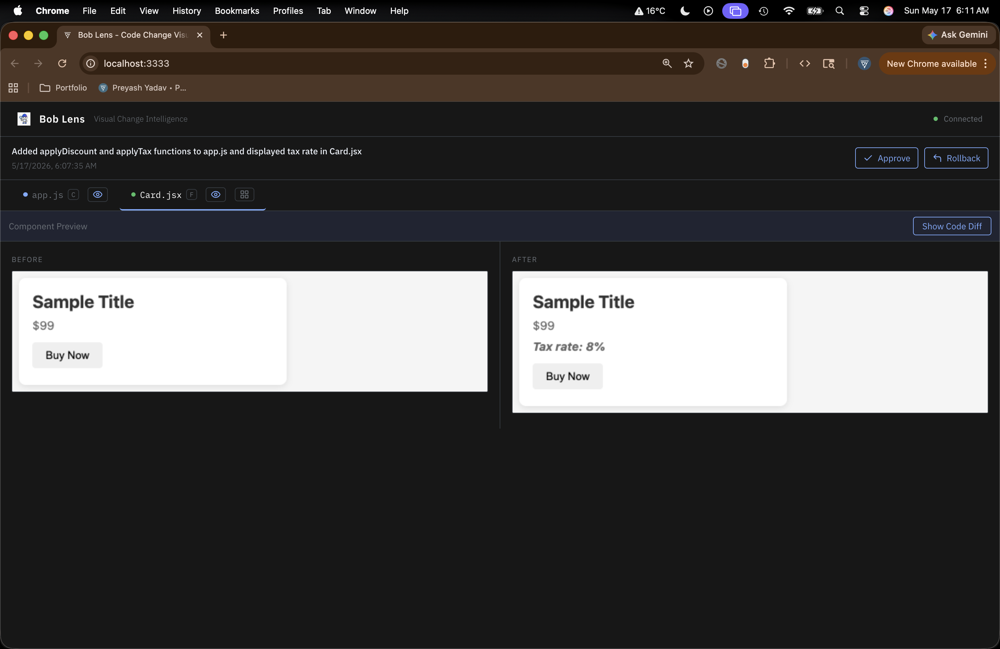

 **Bob Lens**
> Visual Change Intelligence for IBM Bob — see what AI changed, understand it, approve it.

   

## Demo

[Watch the demo video](https://youtu.be/tgtCZiZlT1E)

## What is Bob Lens?
Bob Lens is an npm package that runs alongside IBM Bob IDE. It visualizes AI-generated code changes in real time before you approve them. You get a side-by-side diff, an execution flow diagram with clickable nodes, and (for React) a before/after component preview. Everything is triggered automatically through IBM Bob’s MCP protocol.

## Installation

### Option 1 — Global install from npm (recommended)
```bash
npm install -g bob-lens
```

### Option 2 — Global install from GitHub (pre-release)
```bash
npm install -g github:preyashyadav/bob-lens
```

### Option 3 — From source (development)
```bash
git clone https://github.com/preyashyadav/bob-lens
cd bob-lens
npm install

# If you edit UI/server code, rebuild dist outputs:
(cd mcp-server && npm install && npm run build)
(cd sandbox && npm install && npm run build)
(cd ui && npm install && npm run build)

npm link
```

## Quick Start
```bash
# In any project directory
bob-lens init    # creates .bob/mcp.json, AGENTS.md, bob_sessions/
bob-lens start   # starts UI + sandbox + WebSocket bridge
```
Then: open `http://localhost:3333`; open your project in IBM Bob IDE → MCP Settings → `bob-lens` → Restart; enable MCP auto-approve; ask Bob to make changes and Bob Lens updates automatically.

## What bob-lens init creates
| File | Purpose |
|------|---------|
| `.bob/mcp.json` | Connects IBM Bob IDE to Bob Lens via MCP protocol |
| `AGENTS.md` | Instructs Bob to call notify_change after every file change |
| `.bobignore` | Excludes Bob Lens cache files from Bob's context |
| `bob_sessions/` | Stores exported analysis reports |

## Features
**Side-by-side code diff**: Character-level highlighting within each line, with line numbers. Git-style unified diff below.  
**Execution flow diagram**: Before/after node graph; click nodes to inspect inputs, behavior, outputs; value-flow pills show data movement.  
**Component preview**: For `.jsx` and `.tsx`, Puppeteer renders the React component before and after.  
**BobShell analysis**: BobShell produces a summary, risks, and SAFE/REVIEW/RISKY verdict; export JSON to `bob_sessions/`.

## How IBM Bob Is Used

Bob Lens integrates with IBM Bob at four levels:

| Integration | How |
|-------------|-----|
| MCP Protocol | Bob calls `notify_change` automatically after every file change |
| BobShell | Bob Lens spawns `bob -p "..." --output-format stream-json` to analyze changes |
| Checkpoints | Before-state read from Bob's shadow Git repo via `git show HEAD:file` |
| AGENTS.md | Auto-generated file instructs Bob to always invoke MCP tools |

## Architecture
```text
bob-lens start
├── UI (React + Vite)       → http://localhost:3333
├── WebSocket Bridge        → ws://localhost:8080 (browser connects here)
└── Sandbox (Node.js)       → port 3334 (Puppeteer rendering)
IBM Bob IDE (via .bob/mcp.json)
└── MCP Server              → port 8082/8083
   ├── notify_change       → triggers UI update via broadcast
   ├── ask_bob             → spawns BobShell for analysis
   └── run_test            → sandbox execution
```

## Requirements
- Node.js 18+
- IBM Bob IDE (installed and logged in)
- IBM BobShell (`bob --version` should work in terminal)
- Git

## Screenshots
*Execution flow diagram (React Flow)*  


*Side-by-side diff view*  


## Built For

IBM Bob Hackathon 2026 — *"Turn idea into impact faster"*

Built by [Preyash Yadav](https://www.preyashyadav.com)
