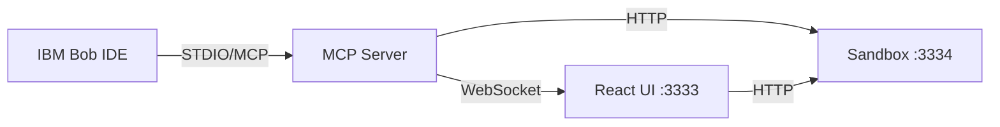

# 🔍 Bob Lens

Local developer tool that connects to IBM Bob IDE via MCP and visualizes AI-generated code changes before the engineer approves them.

## Architecture

Bob Lens consists of three services running locally:

1. **MCP Server** (STDIO) - Connects to Bob IDE, exposes tools, manages WebSocket
2. **React UI** (port 3333) - Visualizes changes with before/after views
3. **Sandbox Runner** (port 3334) - Executes code in isolated environment



## Quick Start

### Prerequisites

- Node.js 18+ and npm
- IBM Bob IDE installed
- Git (for checkpoint references)

### Installation

```bash
# Install all dependencies
npm run install:all

# Build all services
npm run build:all
```

### Configuration

1. Copy environment files:
```bash
cp mcp-server/.env.example mcp-server/.env
cp ui/.env.example ui/.env
cp sandbox/.env.example sandbox/.env
```

2. Register MCP server with Bob IDE:
```bash
# The .bob/mcp.json file is already configured
# Bob will automatically detect it in this directory
```

### Running

```bash
# Start all services in development mode
npm run dev

# Or start individually:
npm run dev:mcp      # MCP Server
npm run dev:ui       # React UI (opens at http://localhost:3333)
npm run dev:sandbox  # Sandbox Runner
```

## MCP Tools

Bob Lens exposes three tools to IBM Bob IDE:

### 1. `notify_change`
Called by Bob after every file write to notify Bob Lens of changes.

```typescript
{
  changedFiles: string[];      // Array of file paths
  checkpointRef: string;       // Git ref or checkpoint ID
  changeDescription?: string;  // Optional summary
}
```

### 2. `ask_bob`
Called by Bob Lens to request behavioral analysis from Bob.

```typescript
{
  question: string;            // Question for Bob
  context: {
    files: string[];           // Relevant files
    changes: object;           // Change details
  }
}
```

### 3. `run_test`
Triggered when engineer clicks "Run Test" in the UI.

```typescript
{
  testInputs: object;          // User-provided test data
  targetFiles: string[];       // Files to test
  checkpointRef: string;       // Version to test
}
```

## Workflow

1. **Bob makes changes** → Calls `notify_change` via MCP
2. **MCP Server** → Broadcasts to UI via WebSocket
3. **UI opens automatically** → Shows before/after diffs
4. **Engineer reviews** → Sees code changes and flow diagrams
5. **Engineer clicks "Run Test"** → Enters test inputs
6. **Sandbox executes** → Returns screenshots + results
7. **UI displays** → Rendered preview and output
8. **Engineer approves/rejects** → Feedback to Bob

## Project Structure

```
bob-lens/
├── .bob/mcp.json           # MCP server registration
├── types/                  # Shared TypeScript types
├── mcp-server/            # MCP server (STDIO transport)
│   ├── src/
│   │   ├── index.ts       # Entry point
│   │   ├── server.ts      # MCP setup
│   │   ├── tools/         # MCP tool implementations
│   │   └── services/      # WebSocket, change tracking
│   └── package.json
├── ui/                    # React + Vite UI
│   ├── src/
│   │   ├── App.tsx        # Root component
│   │   ├── components/    # UI components
│   │   ├── hooks/         # React hooks
│   │   └── services/      # WebSocket client
│   └── package.json
└── sandbox/               # Sandbox runner
    ├── src/
    │   ├── index.ts       # Express server
    │   ├── routes/        # API endpoints
    │   └── services/      # VM execution, screenshots
    └── package.json
```

## Development

### Adding New Features

1. **New MCP Tool**: Add to `mcp-server/src/tools/`
2. **New UI Component**: Add to `ui/src/components/`
3. **New Sandbox Feature**: Add to `sandbox/src/services/`

### Type Safety

Shared types are in `types/` directory:
- `mcp.ts` - MCP tool interfaces
- `change.ts` - Code change types
- `sandbox.ts` - Execution types

### Testing

```bash
# Type checking
npm run type-check --workspace=mcp-server
npm run type-check --workspace=ui
npm run type-check --workspace=sandbox
```

## Troubleshooting

### UI doesn't open automatically
- Check if port 3333 is available
- Verify WebSocket connection at ws://localhost:8080

### Sandbox execution fails
- Check if port 3334 is available
- Verify isolated-vm and puppeteer are installed
- Check sandbox logs for errors
- Note: isolated-vm requires native compilation (node-gyp)

### MCP server not connecting
- Verify `.bob/mcp.json` is in project root
- Check Bob IDE MCP settings
- Restart Bob IDE after changes

## Tech Stack

- **MCP Server**: Node.js, TypeScript, @modelcontextprotocol/sdk, ws
- **UI**: React 18, Vite, TypeScript, WebSocket API
- **Sandbox**: Node.js, Express, isolated-vm, Puppeteer

## License

MIT

## Support

For issues and questions, please open an issue on GitHub.